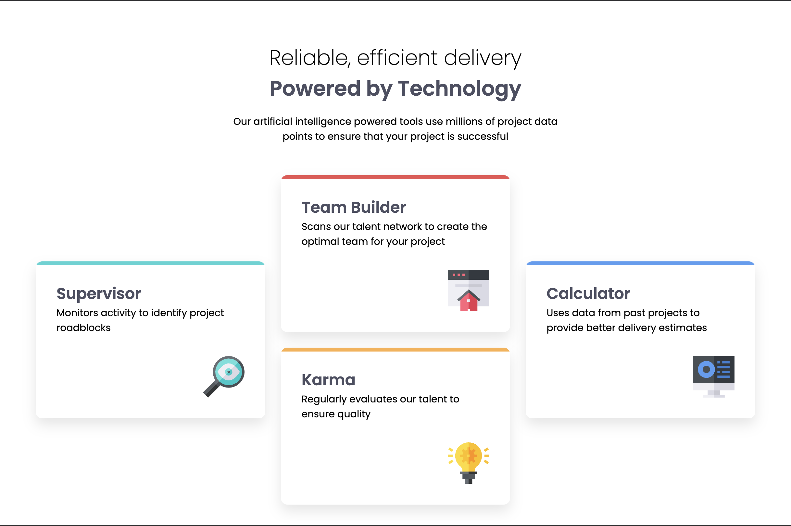
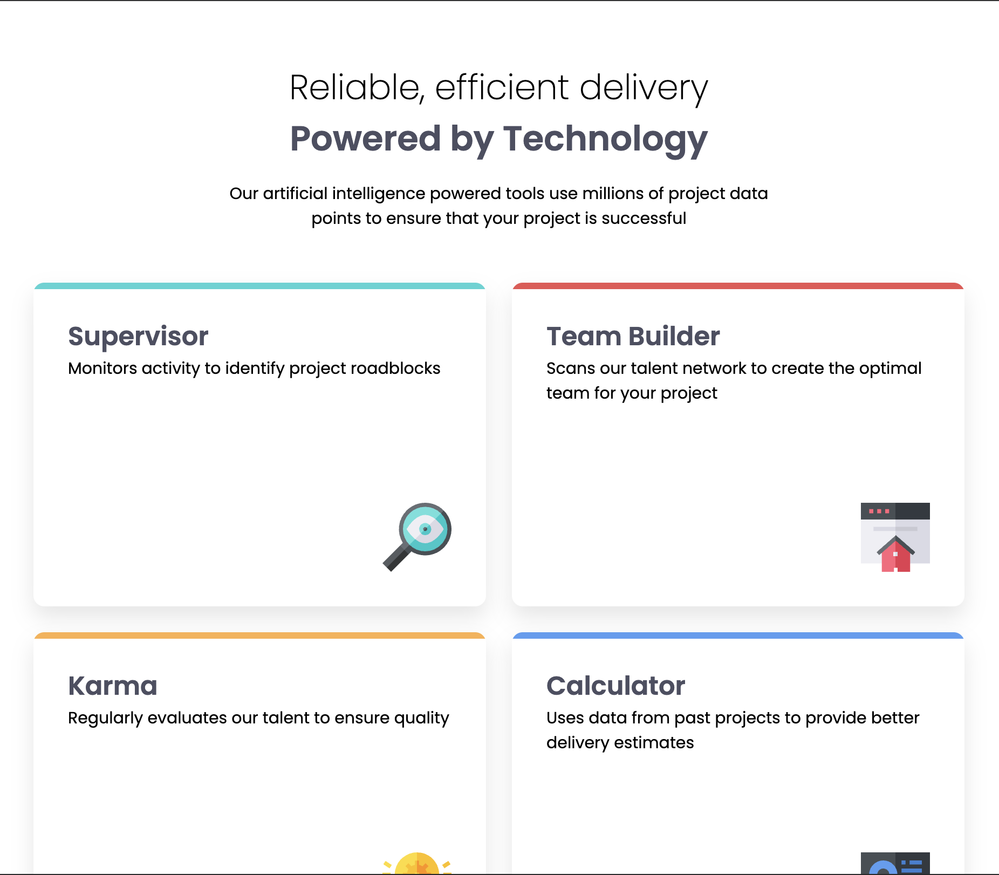
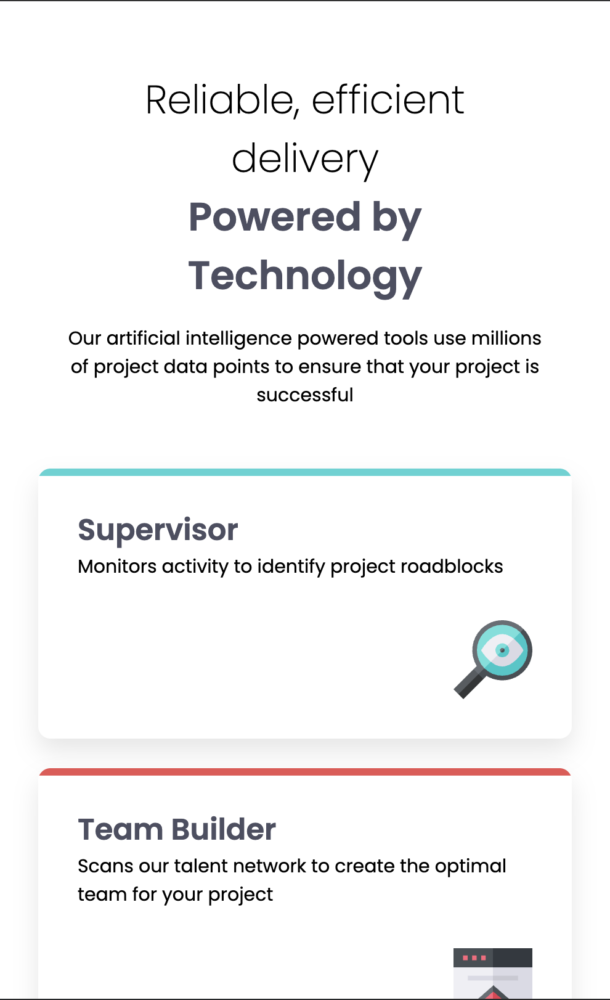

# Frontend Mentor - Four card feature section solution

This is a solution to the [Four card feature section challenge on Frontend Mentor](https://www.frontendmentor.io/challenges/four-card-feature-section-weK1eFYK). Frontend Mentor challenges help you improve your coding skills by building realistic projects. 

## Table of contents

- [Overview](#overview)
  - [The challenge](#the-challenge)
  - [Screenshot](#screenshot)
  - [Links](#links)
- [My process](#my-process)
  - [Built with](#built-with)
  - [What I learned](#what-i-learned)

## Overview

### The challenge

Users should be able to:

- View the optimal layout for the site depending on their device's screen size

### Screenshot

### Links

- Solution URL: 
- Live Site URL: 

## My process

### Built with

- Svelte

### What I learned

I got to practice responsive layouts using grid and flexblox. I created 3 separate grids at 3 different breakpoints. I added a medium 2 by 2 grid because the transition from desktop to mobile looked too stretched in and around the 900px mark, but too swuished at around the 500px mark, so i settled on a third layout.
